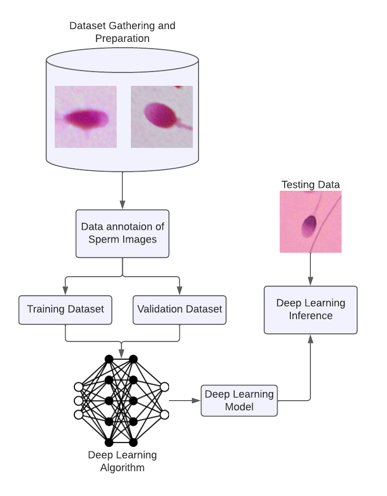

# Mask-RCNN Based Image Segmentation on Human Sperm Head Morphological Quality Classification

    

## Table of Contents
1. [Overview](#overview)
2. [Methodology](#methodology)
3. [Model Evaluation](#model-evaluation)
4. [Inferencing](#inferencing)

## Overview
Sperm, the male reproductive cell, fertilizes the female reproductive cell to create life. Approximately 10% of couples worldwide face infertility, with men accounting for over 30% of cases. Semen analysis, crucial in assessing male infertility, heavily depends on sperm head morphology, which is manually determined, subject to clinician experience, labor-intensive, and prone to variability. To address this, a model is trained to classify and detect sperm head morphological quality, streamlining and standardizing the assessment process.

## Methodology

  

### Dataset Gathering and Preparation

The [first public dataset](https://www.kaggle.com/competitions/sperm-morphological-quality/data) used to make the desired training dataset was from kaggle. The images used for training was from the High-Quality Sperm images which contained 3656 images of bad sperm and 486 good sperm. The bad sperm images contain bad sperm head morphologies like **Tapered** sperm head which are sperm with “cigar-shaped” heads that may abnormal chromatin or packaging of the paternal DNA genetic material. **Pyriform** sperm head which appears to be normal while at different angles the heads appear tapered with the narrowing toward the anterior end giving it a pear-shaped (pyriform) appearance. **Amorphous** sperm head which contain both slightly amorphous those sperms with debris around the neck or a thickened neck but with a normal shaped head, and severly amorhpous those sperms with a bended neck or midpiece.

To further suplement the lack of sperm images the [second public dataset](https://data.mendeley.com/datasets/tt3yj2pf38/3) was from data.mendeley. The dataset contained 4 classes of sperm namely normal(good), tapered, pyriform, and amorphous. However the good sperm images only contained 54 images and therefore data augmentation was performed to reach the target number for the training dataset. 

The desired dataset contained 1300 images which consisted of 2 classes (650 good sperm morphological quality and 650 bad sperm morphological quality). The training dataset was split into an 80%/20% ratio for training and validation set.

    

    

### Dataset Annotation

  

The software labelme was used to annotate and label the datasets. A bounding shape was constructed on the sperm head and was labeled as Good Morphological Quality or Bad Morphological Quality and a corresponding json file of the annotation is automatically saved.

### Deep Learning Model

  

Mask R-CNN is an advanced neural network derived from Faster R-CNN. It enhances object detection by adding a parallel mask prediction branch. Comprising three key components—backbone, Region Proposal Network (RPN), and RoIAlign—Mask R-CNN's foundation is ResNet. RPN scans the image for regions of interest, and RoIAlign accurately generates segmentation masks, replacing RoIPooling. 

The specification for training the dataset was done with the 
Mask R-CNN as the deep learning model. The selected backbone was ResNet-101 which is convolutional neural network that is 101 layers deep. PixelLib library was used as it allows for custom object segmentation as opposed to Coco model. The parameters set for training the custom model were resnet101 for network backbone, 2 for the number of classes, 4 for the batch size and the training was set to 300 epochs.

## Model Evaluation

  

It can be observed that the training loss is lower than the validation loss and the gap between the validation loss narrows over as each epoch passes. However, as the training loss continues to get lower in value the validation loss continues to spike between high and low values regularly. This variability may be attributed to the weights and values changing as the training progresses.

  

The mAP serves as a representation of dataset validation accuracy. Across 300 model evaluations, there's notable variance in mAP, likely due to changing model weights during training. After around 200-300 epochs, mAP tends to stabilize, ranging between 0.60 and 0.89. The highest mAP, 0.8908 (89.1%), was achieved by the 283rd model which was selected for testing and inference.

## Inferencing 

    

    

Inferencing and testing were done using the 283rd model and is applied to images from the [SMIDS dataset](https://data.mendeley.com/datasets/6xvdhc9fyb/1). 5 images are selected from the normal sperm folder to be used for classification of good morphological quality and 5 images are selected from the abnormal sperm folder to be used for classification of bad morphological quality sperm respectively.

    

    

The model was able to classify the sperm image as good morphological quality and bad morphological quality in 5 out of 5 tests.

Rising male infertility rates and manual semen analysis prompted the use of the Mask R-CNN model for precise sperm morphological classification, achieving a top model with 89.1% mAP at the 283rd epoch. Inferences on images and videos from the SMIDS dataset resulted in 98% mean accuracy for good and 98.8% for bad morphological quality, demonstrating Mask R-CNN's potential in semen analysis.
